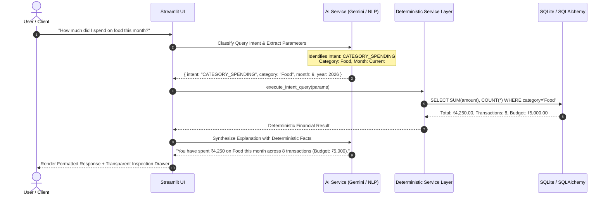
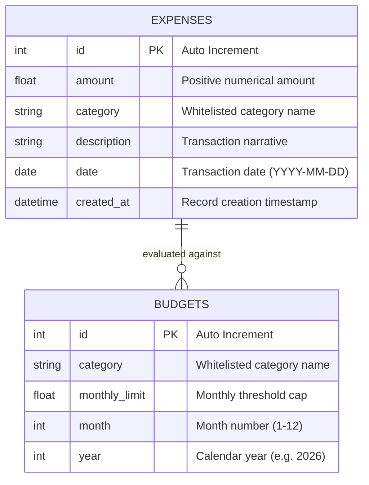

<div align="center">

# 💰 SpendWise

### AI-Powered Personal Expense Assistant & Financial Intelligence Dashboard

[](https://www.python.org/)
[](https://streamlit.io/)
[](https://aistudio.google.com/)
[](https://www.sqlalchemy.org/)
[](tests/)
[](LICENSE)
[](CONTRIBUTING.md)

<p align="center">
  <b>SpendWise</b> bridges the gap between traditional double-entry personal finance tracking and modern Generative AI. It pairs a deterministic SQLite analytics engine with Google Gemini's latest models for natural language transaction logging and conversational financial querying — with zero arithmetic hallucinations.
</p>

[Key Features](#-key-features) •
[Architecture](#-architecture--design-philosophy) •
[Quickstart](#-quickstart-guide) •
[AI Capabilities](#-ai--gemini-integration) •
[Database Management](#-database-view--batch-operations) •
[Testing](#-testing--quality-assurance)

</div>

---

## 📑 Table of Contents

- [Overview](#-overview)
- [Key Features](#-key-features)
- [Architecture & Design Philosophy](#-architecture--design-philosophy)
- [Database Schema](#-database-schema)
- [Project Directory Structure](#-project-directory-structure)
- [Technology Stack](#-technology-stack)
- [Quickstart Guide](#-quickstart-guide)
  - [Prerequisites](#prerequisites)
  - [Installation](#installation)
  - [Configuration](#configuration)
  - [Running the Application](#running-the-application)
- [AI & Gemini Integration](#-ai--gemini-integration)
  - [Dynamic Model Discovery](#dynamic-model-discovery)
  - [Offline Fallback Engine](#offline-fallback-engine)
- [Database View & Batch Operations](#-database-view--batch-operations)
- [Testing & Quality Assurance](#-testing--quality-assurance)
- [Roadmap](#-roadmap)
- [Contributing](#-contributing)
- [License](#-license)

---

## 🌟 Overview

Managing personal expenses is often tedious: manual forms require selecting dates, typing amounts, and picking categories from drop-downs. Conversely, naive "AI expense trackers" that feed an entire SQLite database into an LLM context window suffer from **arithmetic hallucinations, high latency, context limits, and security vulnerabilities**.

**SpendWise** solves this problem through a clean, decoupled architecture:
1. **Natural Language Logging**: Speak or type freely (*"Spent 250 rupees on lunch at college today"*), and Gemini extracts strict, validated JSON for human-in-the-loop confirmation.
2. **Deterministic Calculations**: All sums, budget percentages, run rates, and comparisons are computed directly in Python and SQLite using SQLAlchemy ORM.
3. **Conversational Financial Insights**: Ask questions (*"What was my biggest expense this month?"* or *"Am I exceeding my budget?"*), and SpendWise maps the intent, executes optimized queries, and synthesizes clear, data-grounded answers.
4. **100% Offline-Capable**: Works out of the box with zero external dependencies when no API key is provided, using a built-in heuristic NLP parsing engine.

---

## ✨ Key Features

### 1. 📊 Interactive Financial Dashboard
- **Real-Time KPI Cards**: Total Month Spending, Monthly Budget Limit, Remaining Budget, and Total Transactions.
- **Plotly Visualizations (Dark & Light Mode Adaptive)**:
  - 🍩 **Category Breakdown**: Interactive donut chart visualizing spending distribution across categories.
  - 📈 **Daily Spending Trend**: Cumulative timeline tracking day-by-day cash outflows.
  - 📊 **Historical Trajectory**: 6-month historical spending bar charts.
  - 🏆 **Top Expense Highlights**: Quick-reference table of largest recent purchases.
- **Dynamic Period Selectors**: Instant toggling between current month, previous month, or custom date ranges.

### 2. 🤖 Natural Language Expense Logging
- Powered by **Google Gemini latest models** (e.g., `gemini-flash-latest`, `gemini-2.0-flash`).
- Extracts four core dimensions: `amount`, `category` (strictly mapped to standard whitelisted categories), `description`, and resolved ISO `date` (converting relative references like *"yesterday"* or *"this morning"*).
- **Human-in-the-Loop Review**: Extracted details are rendered in an editable review card before committing to the database.

### 3. 🎯 Category Budgets & Proactive Threshold Alerts
- Configure monthly budget caps across categories (`Food`, `Transport`, `Shopping`, `Bills`, `Entertainment`, `Education`, `Healthcare`, `Electronics`, `Other`).
- Dynamic visual feedback:
  - 🟢 **Normal**: `< 80%` budget consumption.
  - 🟠 **Caution**: `80% - 100%` budget consumption with warning badge.
  - 🔴 **Over Budget**: `> 100%` with exact overage calculation.

### 4. 💬 "Ask SpendWise" Conversational Assistant
- Chat naturally about your financial health:
  - *"How much did I spend on food this month?"*
  - *"What were my biggest expenses?"*
  - *"Compare my spending with last month."*
  - *"Am I close to exceeding any budget?"*
  - *"Give me actionable ways to cut down discretionary spending."*
- **Architecture Transparency**: Includes an expandable inspection drawer detailing the exact classified intent and raw deterministic SQL numbers used to form the response.

### 5. 🔄 Month-over-Month Comparative Analytics
- Side-by-side category comparisons calculating exact absolute differences ($\Delta ₹$) and percentage changes ($\pm\%$).
- Automated spending insights identifying primary growth drivers and categories showing significant reductions.
- **Linear Run-Rate Forecasting**:
  $$\text{Projected Total} = \left(\frac{\text{Current Spent}}{\text{Days Elapsed}}\right) \times \text{Days in Month}$$

### 6. 🗄️ Database Management & Batch Operations
- Dedicated **Database View** for raw inspection of `expenses` and `budgets` tables.
- **Multi-Select Batch Delete**: Remove individual records or perform atomic bulk deletions of selected or filtered transactions.
- **CSV Data Portability**: Export expense records or budget allocations to CSV in one click.

---

## 🏛️ Architecture & Design Philosophy

SpendWise adheres to the **Separation of Concerns (SoC)** principle: language models handle natural language translation, while relational databases and Python handle arithmetic computation.



---

## 🗄️ Database Schema

The SQLite database is managed via **SQLAlchemy 2.0+ ORM** with indexes on foreign dates and categories for rapid lookups:



---

## 📂 Project Directory Structure

```text
spendwise/
│
├── app.py                      # Main Streamlit application entry point & routing
├── requirements.txt            # Project dependencies
├── .env.example                # Environment variables template
├── .gitignore                  # Git ignore rules
├── LICENSE                     # MIT open-source license
├── README.md                   # Comprehensive documentation
├── pytest.ini                  # Pytest configuration
├── spendwise.db                # SQLite database (auto-generated)
│
├── database/
│   ├── __init__.py
│   ├── database.py             # SQLite engine setup, session factories, and context managers
│   └── models.py               # SQLAlchemy ORM models (Expense, Budget) and whitelists
│
├── services/
│   ├── __init__.py
│   ├── expense_service.py      # CRUD, validations, filtering, and batch deletions
│   ├── budget_service.py       # Budget creation, threshold evaluations, and alerts
│   ├── analytics_service.py    # Aggregations, month-over-month deltas, run-rate projections
│   └── ai_service.py           # Gemini dynamic discovery, intent classification, NLP extraction
│
├── ui/
│   ├── __init__.py
│   ├── dashboard.py            # KPI metric cards and Plotly chart layouts
│   ├── expenses.py             # Expense tables, manual entry form, and AI text extractor
│   ├── budgets.py              # Budget management, progress gauges, and threshold tags
│   ├── assistant.py            # Conversational chat interface with inspection drawer
│   ├── insights.py             # Comparative analysis and spending projections
│   └── database_view.py        # Raw table views, search filters, and batch delete tools
│
├── utils/
│   ├── __init__.py
│   └── helpers.py              # Currency formatters, date mathematics, and demo data generator
│
└── tests/
    └── test_services.py        # 12 automated unit tests covering all services
```

---

## 🛠️ Technology Stack

| Layer | Technology | Rationale |
| :--- | :--- | :--- |
| **Frontend & UI** | [Streamlit](https://streamlit.io/) | Fast, reactive Python web UI with native dark/light mode support |
| **Language & Runtime** | [Python 3.11+](https://www.python.org/) | Type hint support, clean concurrency, modern packaging |
| **ORM & Database** | [SQLAlchemy 2.0](https://www.sqlalchemy.org/) / SQLite | Zero-configuration relational storage with robust ORM abstractions |
| **Generative AI** | [Google Gemini API](https://aistudio.google.com/) | High-speed, cost-effective structured reasoning (`gemini-flash-latest`) |
| **Data & Charts** | [Pandas](https://pandas.pydata.org/) & [Plotly](https://plotly.com/) | Interactive, client-side zooming, donut/bar charts with transparent styling |
| **Environment** | [python-dotenv](https://github.com/theskumar/python-dotenv) | Clean separation of secrets from version control |
| **Testing** | [Pytest](https://pytest.org/) | Comprehensive unit test suite with in-memory SQLite isolation |

---

## 🚀 Quickstart Guide

### Prerequisites
- Python 3.11 or higher installed on your system.
- Git installed.

### Installation

1. **Clone the repository**:
   ```bash
   git clone https://github.com/Anshuman-Raj-07/spendwise.git
   cd spendwise
   ```

2. **Create and activate a virtual environment**:
   ```bash
   # Linux / macOS
   python3 -m venv venv
   source venv/bin/activate

   # Windows
   python -m venv venv
   venv\Scripts\activate
   ```

3. **Install dependencies**:
   ```bash
   pip install --upgrade pip
   pip install -r requirements.txt
   ```

### Configuration

SpendWise is configured to run immediately. Optionally configure a Google Gemini API key to enable AI-powered natural language extraction and conversational responses:

1. Copy the sample environment file:
   ```bash
   cp .env.example .env
   ```

2. Get a free API key from [Google AI Studio](https://aistudio.google.com/app/apikey).
3. Paste the key into `.env`:
   ```env
   GEMINI_API_KEY=AIzaSyYourActualKeyHere
   ```
> **Note**: You can also enter or test your Gemini API key directly from the application's sidebar at runtime without restarting.

### Running the Application

Launch the Streamlit app:
```bash
streamlit run app.py
```

The application will launch automatically in your browser at `http://localhost:8501`.

---

## 🤖 AI & Gemini Integration

### Dynamic Model Discovery
Rather than hardcoding static or deprecated model versions that risk 404 errors, SpendWise implements **dynamic endpoint discovery**:
- Queries Google's `/v1beta/models` endpoint for the active API key.
- Filters models supporting `generateContent`.
- Employs an intelligent ranking algorithm (`rank_latest_model`) to automatically select Google's newest and fastest Flash release (e.g., `gemini-flash-latest`, `gemini-2.0-flash`).
- Automatically falls back to Google's official OpenAI-compatible endpoint (`/v1beta/openai/chat/completions`) if direct REST endpoints are restricted.

### Offline Fallback Engine
SpendWise is engineered with **zero external blockers**:
- If no API key is provided, or if network connectivity is interrupted, SpendWise automatically falls back to its built-in regex and heuristic NLP extraction engine.
- Natural queries in "Ask SpendWise" resolve deterministically to Python/SQLite calculations with human-readable text generation.

---

## 🗄️ Database View & Batch Operations

For administrative control over financial records, SpendWise features a dedicated **Database View**:
- **Granular Filtering**: Filter transactions by category or search across descriptions and dates.
- **Batch Deletion**: Select multiple records using interactive checkboxes or perform bulk deletions on filtered results.
- **Data Export**: Export tables directly to UTF-8 CSV for external audits or spreadsheets.

---

## 🧪 Testing & Quality Assurance

SpendWise includes a comprehensive test suite executed against isolated, in-memory SQLite databases:

```bash
pytest tests/ -v
```

### Test Coverage Highlights (12/12 Passing)
- `test_add_valid_expense`: Verifies expense addition, field constraints, and normalization.
- `test_invalid_expense_values`: Validates non-zero positive amounts and required descriptions.
- `test_update_and_delete_expense`: Ensures atomic record updates and deletions.
- `test_spending_and_category_breakdown`: Tests category aggregations and percentage shares.
- `test_budget_status_thresholds`: Verifies alerts at `<80%`, `80%-100%`, and `>100%` overages.
- `test_monthly_comparison`: Tests delta arithmetic and percentage calculations across periods.
- `test_rule_based_intent_classification`: Validates deterministic NLP intent classification.
- `test_ai_response_sanitization`: Verifies whitelist category mapping and error handling.
- `test_batch_delete_expenses`: Verifies atomic multi-record expense deletion.
- `test_batch_delete_budgets`: Verifies atomic multi-record budget deletion.
- `test_gemini_fallback_endpoints_configured`: Validates fallback endpoint configuration.
- `test_rank_latest_model_prioritization`: Validates dynamic model ranking logic.

---

## 🔮 Roadmap

- [ ] **Multi-User Authentication**: Secure user login with Supabase Auth or OAuth2.
- [ ] **Statement Ingestion**: Import bank transaction CSVs and PDF statements.
- [ ] **Receipt OCR Scanning**: Capture and parse paper receipts using Gemini multimodal vision.
- [ ] **Recurring Subscriptions**: Automatic tracking and reminders for monthly bills.
- [ ] **Export to PDF**: Generate executive monthly financial summaries.

---

## 🤝 Contributing

Contributions are welcome! Please follow these steps:

1. **Fork the repository**.
2. **Create a feature branch**:
   ```bash
   git checkout -b feature/amazing-feature
   ```
3. **Commit your changes**:
   ```bash
   git commit -m "feat: add amazing feature"
   ```
4. **Push to the branch**:
   ```bash
   git push origin feature/amazing-feature
   ```
5. **Open a Pull Request**.

Please ensure that `pytest tests/ -v` passes before submitting PRs.

---

## 📄 License

Distributed under the **MIT License**. See [`LICENSE`](LICENSE) for details.

---

<div align="center">
  <sub>Built with ❤️ using Python, Streamlit, and Google Gemini.</sub>
</div>
